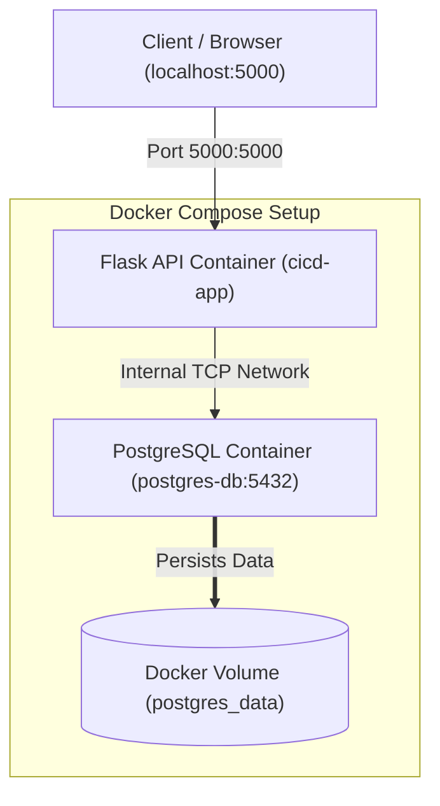

# CI/CD Job Tracker (Containerized)

An interview-ready showcase of a containerized **Flask + PostgreSQL** application, designed to track GitHub Action workflows. This repository demonstrates core DevOps concepts: **multi-container orchestration, data persistence, network isolation, and automated CI pipelines**.

---

## 🏗️ Architecture



### 1. Services
*   **API Service (`cicd-app`)**: A Python 3.11 Flask API running on port `5000`. It connects to PostgreSQL using SQLAlchemy to manage Workflow runs and exposes status/config endpoints.
*   **Database Service (`postgres-db`)**: A Postgres 15 database instance listening internally on port `5432`.
*   **Volume (`postgres_data`)**: Map directory `/var/lib/postgresql/data` from the DB container to hold tables and data robustly across restarts.

---

## 🚀 Quick Start (1-Minute Setup)

### 1. Set GitHub Environment Variables
Create a `.env` file (or export variables in terminal) to configure GitHub API settings:
```bash
GITHUB_OWNER="your-github-username"
GITHUB_REPO="your-repo-name"
GITHUB_TOKEN="your-personal-access-token"
```

### 2. Build & Launch Containers
Spin up the application and DB services in detached mode:
```bash
docker compose up --build -d
```

### 3. Verify Endpoints
```bash
# 1. Health Status
curl http://localhost:5000/health
# Expected: {"status": "UP"}

# 2. Config Endpoint 
curl http://localhost:5000/github-config
# Expected: {"api_url": "...", "owner": "...", "repository": "..."}
```

### 4. Tear Down
```bash
# Stop and remove containers (keeps database data)
docker compose down

# Stop and wipe volume/data (resets database)
docker compose down -v
```

---

## 🎙️ Interview Cheat Sheet: Containerization

When showcasing this during interviews, be ready to explain these five concepts:

### 1. Multi-Container Orchestration (Docker Compose)
*   **Question**: Why use Docker Compose instead of launching containers with `docker run`?
*   **Answer**: Docker Compose allows us to define multi-container environments in a single declarative YAML file (`docker-compose.yml`). Instead of starting, networking, and linking Python and PostgreSQL containers individually, developers can manage the entire application stack lifecycle with one command: `docker compose up`.

### 2. Service Discovery & Communication
*   **Question**: How does Flask connect to PostgreSQL inside the container network?
*   **Answer**: Docker Compose creates a default shared network for services. Services can reach each other using their service name as the hostname. In [docker-compose.yml](file:///c:/SRI/Srinithi_projects/Git/ci-cd-job-tracker/docker-compose.yml), the DB service is named `db`, so Flask uses the database connection string: `postgresql://postgres:postgres@db:5432/cicd_db`.

### 3. Data Persistence
*   **Question**: What happens to PostgreSQL data when you destroy the DB container?
*   **Answer**: By default, containers are ephemeral—if they stop/destroy, all internal data is lost. To persist tables and workflows, we use a Docker **Volume** (`postgres_data`) mapped to `/var/lib/postgresql/data` (Postgres' default storage directory). This mounts the storage directory on the host machine, keeping our data safe across rebuilds.

### 4. Container Startup Dependencies / Crash Loop Backoff
*   **Question**: How did you handle the issue of Flask starting before PostgreSQL is ready?
*   **Answer**: Database engines take a few seconds to initialize and start accepting connections. In [app.py](file:///c:/SRI/Srinithi_projects/Git/ci-cd-job-tracker/app.py), we introduced a simple `time.sleep(10)` delay before running database migrations (`db.create_all()`). Under production workloads, a **healthcheck dependency** configuration in Docker Compose or a retry-connection loop script (like `wait-for-it.sh`) is preferred.

### 5. Automated CI/CD (GitHub Actions)
*   **Question**: How is Docker tested automatically?
*   **Answer**: We have a CI pipeline in [.github/workflows/docker-ci.yml](file:///c:/SRI/Srinithi_projects/Git/ci-cd-job-tracker/.github/workflows/docker-ci.yml). Upon pushing to the `main` branch, the pipeline will check out the codebase, build and start containers via `docker compose up --build -d`, verify the app's health and configuration endpoint are active, and showcase application log status.

---

## 🛠️ Essential Commands for Interviews

| Command | Action | Key Use Case |
|---|---|---|
| `docker compose ps` | Show container state. | Verify if containers are running, restarting, or exited. |
| `docker compose logs -f` | Stream container logs stdout/stderr. | Debugging database connection failures. |
| `docker compose exec app printenv` | Run commands in a running container. | Inspecting current running environment variables. |
| `docker compose up --force-recreate` | Force recreation of all containers. | Refresh code changes without rebuilding dependencies. |
